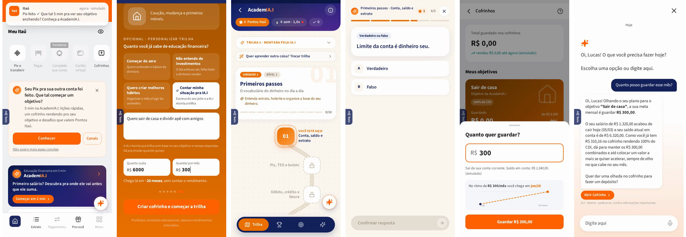

# AcademIA.I — Hackathon Itaú 2026

Protótipo interativo da **AcademIA.I**, uma área de educação financeira dentro do app Itaú que transforma o objetivo de um jovem em rotina de guardar dinheiro no Itaú. Case A, "Primeira vida financeira", do Hackathon Itaú 2026.

**[Abrir o protótipo](https://hack-itau-academia-i.vercel.app)** · **[Ver o showcase em vídeo](https://hack-itau-academia-i.vercel.app/showcase/)**



> Protótipo de hackathon. Salário, saldos, rendimentos, Pontos Itaú e integrações são **simulados**. Nenhum dado real é usado e nenhum dinheiro é movimentado.

## O problema

O Lucas tem 19 anos. No dia 5 caem R$ 1.320 no Itaú e, minutos depois, quase tudo vai para outro banco. Ele não decidiu sair do Itaú; só nunca teve um motivo para ficar.

- 89% da Geração Z brasileira usa mais de um banco (Visa, Panorama da Principalidade, 2025)
- 49% da Geração Z trocaria de banco por ajuda para atingir metas (Tink/Visa, 2024)
- 47% dos jovens de 18 a 24 anos não controlam as finanças (CNDL/SPC Brasil, 2018)

Falta hábito, sobra vontade.

## A solução

Logo depois do Pix que levaria o salário embora, o app convida o jovem a definir um objetivo (um celular, sair de casa). A partir daí:

1. **Personalizar**: a IA monta uma trilha de lições a partir do objetivo e do que a pessoa conta com as próprias palavras.
2. **Aprender**: lições de menos de um minuto, com quiz e um chat (IA.I) para dúvidas.
3. **Ganhar**: o objetivo vira um cofrinho com meta e prazo, e aprender e guardar rendem Pontos Itaú (com teto trimestral).

**Onde a IA entra e onde não entra.** A IA escreve, explica e escolhe a ordem do conteúdo. Prazos, saldos, rendimentos e pontos vêm de regras fixas no código. A IA.I nunca movimenta dinheiro nem recomenda crédito ou investimento: ela orienta e oferece o atalho, e quem age é o usuário.

## Jornada do protótipo

| Etapa | Rota |
| --- | --- |
| Pré-login e home | `/`, `/home` |
| Pix que dispara o convite | `/pix` → … → `/pix/sucesso` |
| Boas-vindas e objetivo | `/academia/intro` |
| Trilha, lições e desafios | `/academia/trilha`, `/academia/licao/:id`, `/academia/desafio/:unit` |
| Missões | `/academia/missoes` |
| Cofrinho | `/cofrinhos` |
| Pontos e vantagens | `/minhas-vantagens`, `/itau-shop` |
| Chat IA.I | `/ia` |

O botão **Teste**, na lateral da tela, abre o painel de simulação: passar o tempo, guardar ou resgatar do cofrinho, simular compras e Pix, pular etapas e resetar a jornada.

## Rodando localmente

Requer Node 20+.

```bash
npm install
cp .env.example .env   # opcional: GEMINI_API_KEY para a IA.I
npm run dev            # http://localhost:5173
npm run build          # typecheck + build em dist/
```

Sem `GEMINI_API_KEY` o app funciona normalmente: a trilha é montada por regras locais e só o chat da IA.I fica indisponível.

## Stack

- React 18, TypeScript, Vite, Tailwind CSS, framer-motion, react-router
- `api/chat.ts`: função serverless (Vercel) que chama o Gemini; no `npm run dev` ela é servida pelo próprio Vite. Aceita apenas requisições do domínio do app (`ALLOWED_ORIGINS` libera hosts extras).
- Deploy na Vercel: importe o repositório (framework Vite); o `vercel.json` já inclui o rewrite de SPA.

```
api/        função serverless da IA.I
src/
  screens/  telas do app (Pix, home, cofrinho, vantagens, academia/…)
  components/
  data/     trilha, unidades de conteúdo, regras de dinheiro e pontos
  state/    contexto do Pix e da trilha
public/showcase/  player do vídeo de demonstração
showcase/   guia, exportador MP4 e legendas do showcase
email/      template e script do convite por e-mail
docs/       material do case
```

## Showcase em vídeo

Player em `public/showcase/index.html` (publicado em `/showcase/`): o vídeo do app dentro de um frame de celular, com textos sincronizados às ações. Para exportar em MP4 (1920×1080, com o áudio original):

```bash
npx playwright install ffmpeg
npm run showcase:export
```

Usa o Chrome ou Chromium do sistema (ou `CHROME_PATH`). Detalhes em [`showcase/GUIA_SHOWCASE.md`](showcase/GUIA_SHOWCASE.md); legendas para YouTube em [`showcase/legendas_pt-BR.srt`](showcase/legendas_pt-BR.srt).

## E-mail de convite

Template em `email/convite.html` (`{{saudacao}}` vira "Oi, Nome!"). Envio pelo Resend com `RESEND_API_KEY`; remetente padrão `AcademIA.I (protótipo) <itau@kgmats.cc>` (troque com `EMAIL_FROM`).

```bash
npm run email:convite -- --dry-run email/exemplo.csv   # só lista quem receberia
npm run email:convite -- email/exemplo.csv             # CSV "nome,email" (ou só "email")
npm run email:convite -- "ana@exemplo.com,Ana" bia@exemplo.com
```

Em código: `import { sendInvite } from "./email/enviar.mjs"` e `await sendInvite({ to, name })`.

## Time

Marcos Menezes, Matheus Cunha, Kayky Gibran e equipe, no Hackathon Itaú 2026 (26 e 27 de setembro, CEIC Jabaquara, São Paulo).

O material original do case está em [`docs/case-a-primeira-vida-financeira.pdf`](docs/case-a-primeira-vida-financeira.pdf).
